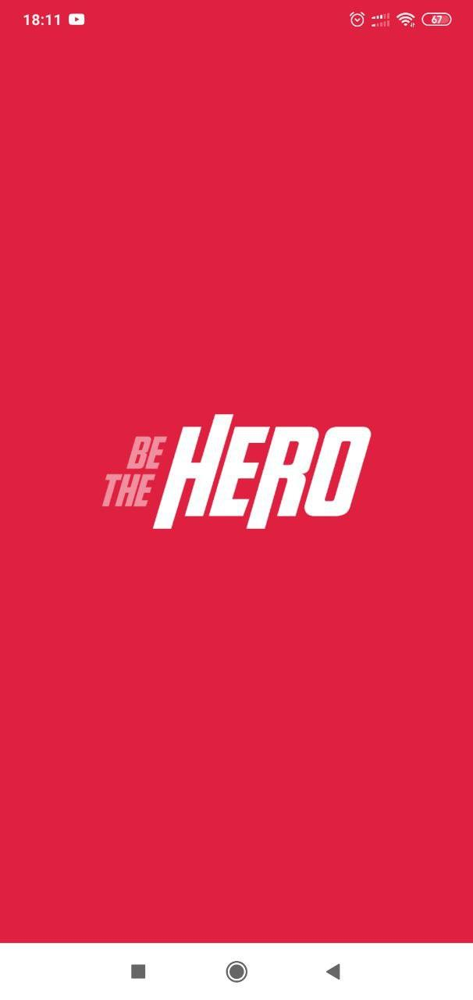
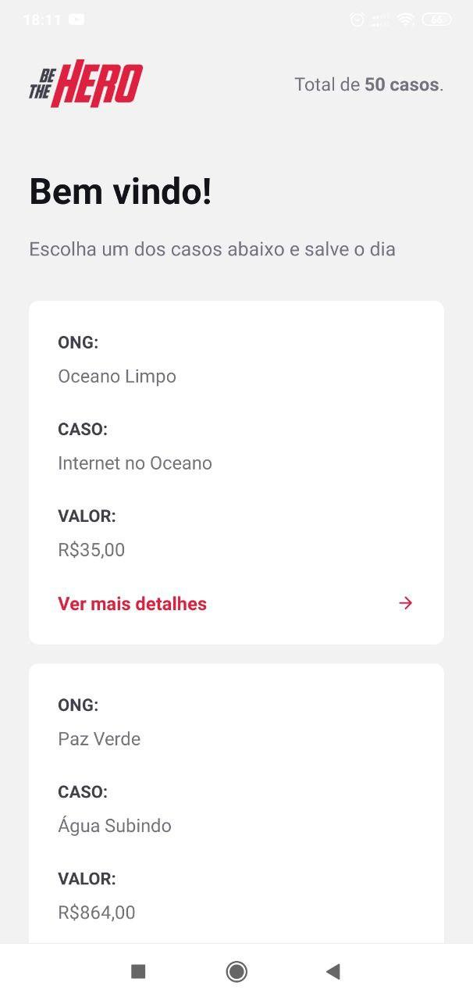
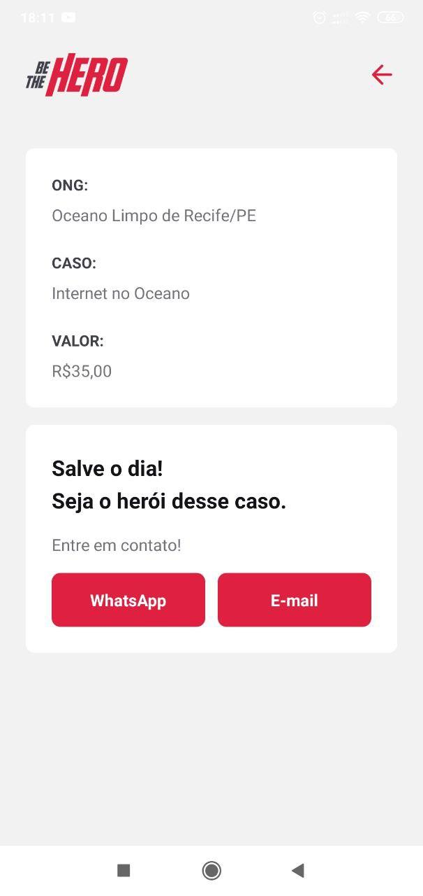

<h1 align="center">
  <a href="https://github.com/WesGtoX/be-the-hero">
    
  </a>
  <br />
  <a href="https://app.netlify.com/sites/bethehero-wes/deploys" alt="Netlify Status">
    
  </a>
</h1>

<p align="center">
  <a href="#about-the-project">About</a>&nbsp;&nbsp;|&nbsp;&nbsp;
  <a href="#technology">Technology</a>&nbsp;&nbsp;|&nbsp;&nbsp;
  <a href="#layout">Layout</a>&nbsp;&nbsp;|&nbsp;&nbsp;
  <a href="#getting-started">Getting Started</a>&nbsp;&nbsp;|&nbsp;&nbsp;
  <a href="#usage">Usage</a>&nbsp;&nbsp;|&nbsp;&nbsp;
  <a href="#roadmap">Roadmap</a>&nbsp;&nbsp;|&nbsp;&nbsp;
  <a href="#how-to-contribute">Contributing</a>&nbsp;&nbsp;|&nbsp;&nbsp;
  <a href="#license">License</a>
</p>

<p align="center">
  
  
  
  
  
  
</p>


## About the Project

Be The Hero is a platform to connect NGOs, institutions and volunteers who want to be the hero of a cause.

- Mobile: [Be The Hero on Expo](https://expo.io/@wesgtox/bethehero)


## Technology

This project was developed with the following technologies:

- [Node.js](https://nodejs.org/)
- [Yarn](https://yarnpkg.com/)
- [React](https://reactjs.org/)
- [React Native](https://reactnative.dev/)
- [Expo](https://expo.dev/)


## Layout

<p align="center">
  <a href="https://expo.io/@wesgtox/bethehero">
    
  </a>
    <a href="https://expo.io/@wesgtox/bethehero">
    
  </a>
    <a href="https://expo.io/@wesgtox/bethehero">
    
  </a>
</p>


## Getting Started

### Prerequisites

- [Node.js](https://nodejs.org/en/download/)
- [Yarn](https://yarnpkg.com/getting-started/install)


### Install and Run

- Clone the repository:
```bash
git clone https://github.com/WesGtoX/be-the-hero.git
cd be-the-hero/
```

#### Run the API:
1. Install the dependencies:
```bash
yarn install
```
2. Run database migrations:
```bash
npx knex migrate:latest
```

3. Run the API:
```bash
yarn dev
```

4. To run the tests:
```bash
yarn test
```

#### Run the Web Application:
1. Access the Web Application project folder:
```bash
cd frontend/
```

2. Install dependencies:
```bash
yarn install
```

3. Run the Web APP:
```bash
yarn start
```

#### Run the Mobile Application:
1. Access the Mobile project folder:
```bash
cd mobile/
```

2. Install dependencies:
```bash
yarn install
```

3. Run the Mobile APP:
```bash
yarn start
```

#### Building Standalone Apps:
- Android
```bash
expo build:android -t apk
```

- iOS
```bash
expo build:ios
```

**Obs:** If you receive the error: `connect ECONNREFUSED 127.0.0.1: 19001`
> Leave it running in another terminal window:
> ```bash
> expo start
> ```
> Then run the build again.


## Usage

### Routes / Resources

| Method   | Endpoint         | Description              |
| -------- | ---------------- | ------------------------ |
| `POST`   | `/sessions`      | ONG login.               |
| `POST`   | `/ongs`          | Register a ONG.          |
| `GET`    | `/ongs`          | List all ONGs.           |
| `POST`   | `/incidents`     | Register a incidents.    |
| `GET`    | `/incidents`     | List all incidents.      |
| `GET`    | `/profile`       | List a specific profile. |
| `DELETE` | `/incidents/:id` | Delete a incidents.      |

### HTTP methods

- **GET:** _Fetching information from the back-end._
- **POST:** _Create information on the back-end._
- **PUT:** _Changing information on the back-end._
- **DELETE:** _Delete an information on the back-end._


### Parameter types

- **Query Params:** _Named parameters sent on the route after the `?` (Filters, Pagination)._
- **Route Params:** _Parameters used to identify resources._
- **Request Body:** _Request body, used to create or change resources._


### Database

- **SQL:** _MySQL, SQLite, PostgreSQL, Oracle, Microsoft SQL Server._
- **NoSQL:** _MongoDB, CouchDB, etc._

- **Driver:** _SELECT * FROM users._
- **Query Builder:** _table('users').select('*').where()._


## Roadmap

See the [open issues](https://github.com/WesGtoX/be-the-hero/issues) for a list of proposed features (and known issues).


## How to contribute

Contributions are what make the open source community such an amazing place to be learn, inspire, and create. Any contributions you make are **greatly appreciated**.

1. Fork the Project.
2. Create your Feature Branch `git checkout -b feat/my-feature`.
3. Commit your Changes `git commit -m 'feat: My new feature'`.
4. Push to the Branch `git push origin feat/my-feature`.
5. Open a Pull Request.

After the merge of your pull request is done, you can delete your branch.


## License

Distributed under the MIT License. See [LICENSE](LICENSE) for more information.

---

Made with ♥ by [Wesley Mendes](https://wesleymendes.com.br/) :wave:
